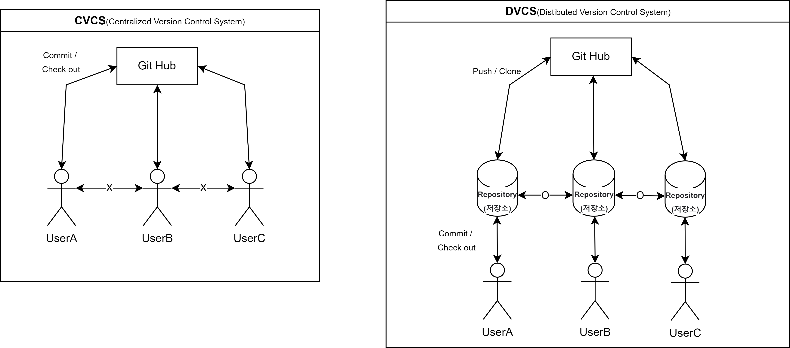
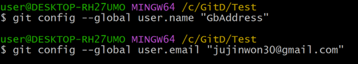
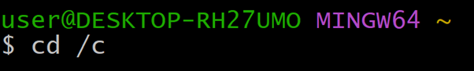
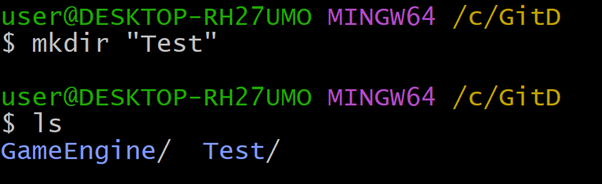
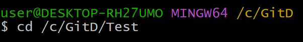
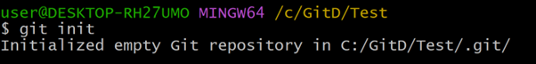
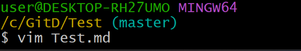

# 유한대학교 프로그래밍 패턴 2주차 과제

 ## VCS란 무엇인가?
 -------------
    * VCS는 Version Control System의 약자로, 파일의 변화를 추적하고 관리하는 시스템이다.
    * 여러명이 함께 진행하는 프로젝트가 있을 경우 GitHub와 같은 원격 저장소를 통해 더 안전하고 효율적으로 작업이 진행될 수 있도록 모든 수정사항들을 프로젝트 참여자들의 명령에 따라 동기화 및 저장하며, 수정에 대한 정보(누가,언제,어떤 파일을, 파일의 어떤 부분을 수정했는지)를 제공준다.
    * Git은 여러명이 같이 쓰는 협업 툴로, 각기 다른 소스코드를 한 공간에서 같이 작업하고 코드의 버전을 관리해주는 저장소다.

 ## DVCS와 VCS의 차이점
------------------------------------------

<div>

</div>

    * Vcs의 방식 중 과거에 주로 사용 되던 CVCS는 프로젝트 파일이 서버 한곳에만 위치해 있으며, 파일 버전이 일관적이게 되어 관리자가 신경써야 하는 문제가 많지 않아 관리하기 편하다.
    * 하지만 CVCS는 서버에만 의존하는 방식이기 때문에 네트워크에 문제가 생겼을 경우 개발자들은 파일을 올리지 못하여 프로젝트를 진행할 수 없다.
    * 이러한 단점들을 보안하고자 DVCS가 생겨났으며, DVCS에서는 원격 저장소에 저장하는것이 필수가 아닌 선택사항이고 로컬 저장소에 먼저 저장 한 뒤에 명령이 가능하기 때문에 로컬 저장소(참여자들의 각 컴퓨터 디스크)에 프로젝트파일들을 1차적으로 저장하고 사용자의 명령에 따라 원격 저장소(서버 저장소)에도 저장할 수 있습니다.
    * 파일을 서버와 각 참여자들의 컴퓨터에 분산하여 저장할 수 있기 때문에 어느 한쪽에 문제가 생겨 파일이 손상되거나 히스토리가 지워지더라도 다른 쪽에서 받을 수 있어 쉽게 복구할 수 있습니다.
    * 만약 네트워크 문제로 원격 저장소와 통신이 되지 않는다면 각 참여자들끼리 로컬 저장소내의 파일들을 다양한 방법(이메일 등)으로 주고 받을 수 있어 프로젝트를 계속 진행할 수 있습니다.
    * 그리고개발자의 실수로 잘못 커밋을 했더라도 원격 저장소로 올리기 전이었다면 다른 개발자들에게 영향을 주기않고 수정 할 수 있습니다.

 ## GIT을 이용하여 remote repository를 생성하고git용 bash로 local repository랑 연결하는 과정을 스크린샷과 함께 각 명령어의 자세한 설명을 작성하시오.
 --------------------

#### 1. 사용자의 이름과 이메일을 초기화합니다.
-----------------------------

<div>

</div>

    
#### 2. 자신이 원격 저장소와 연동하고자 하는 디렉토리로 이동합니다.
-----------------------------------

<div>

</div>


#### 3. 이동한 후 [$ mkdir]을 통해 [GitD]폴더 안에 [Test]라는 폴더를 생성합니다. 생성한 후 [GitD]폴더 안에 있는 파일을 [ls]를 통해서 확인합니다.
--------------------

<div>

</div>

#### 4. 만들어진 [Test]폴더에 이동합니다.
-------------

<div>

</div>

#### 5. [$ git init]을 사용하여 [Test]의 저장소를 초기화 해줍니다.
------------------

<div>

</div>

#### 6. [$ git remote add origin {git주}]를 입력하여 본인의 GIT 주소를 입력합니다.
-------------------

<div>

</div>

#### 7. [$ vim Test.md]를 입력하여 'Test.md'라는 ReadMe 파일을 [Test]폴더에 생성합니다. 내용을 작성하고 [:w]를 사용하여 저장하고 [:q]를 사용하여 초기화면으로 돌아갑니다.
---------------

<div>


</div>

#### 8. [$ git add .]로 폴더안에 있는 모든 파일을 더해줍니다.
-------------

<div>

</div>

#### 9. [$ git commit -m "git"]git이라는 이름으로 로컬 저장소로 보냅니다.
-----------------

<div>

</div>

#### 10. [$ git push –set-upstream origin main]을 사용해 원격 서버에 [Test.md]를 업로드 해줍니다.
-----------------

<div>

</div>

#### 11. 성공적으로 올라간 것을 확인할 수 있습니다.
------------------------------

<div>

</div>


 ## .gitignore 사용법과 작성방식 및 내용에 대해서 조사를 해 오시오. (이클래스에 있는 Visual Studio 2022 C++ 프로젝트용 ignore도 git에 업로드 해주세요.)
 ---------------------
    

* ReadMe.md 파일에 사용된 Mark Down 표기법에 대해서 헤더/목록(숫자)/순서없는목록/들여쓰기/코드블럭/수평선/링크/이미지/강조에 대해 사용방법을 정리해 오시오.
 --------------------

* 헤더: 제목으로 #으로 사용할 수 있습니다.

# h1
## h2
### h3
#### h4

* 줄 바꿈 : 줄 바꿈은<br/>로 작성된다. 혹은 띄어쓰기 두 번 후 엔터를 쳐도 됩니다.

    Test<br/>

* 인덱싱 : "1."을 작성하고 엔터를 치면 순차적으로 번호가 자동생성됩니다.

1. 가
2. 나
3. 다

* 순서없는 목록: 순서가 없는 리스트는 항목 앞에 * , - , + 를 입력합니다. 모두 같은 기호로 입력해도 되고, 기호들을 혼합해서 사용해도 됩니다.

* 가
    - 나
        + 다

* 들여쓰기 : 공백을 만드는 작업입니다.

* 가
    * 나
* 다

* 코드 블럭: 코드 블럭 코드(```) 시작점에 사용하는 언어를 선언하여 문법 강조가 가능합니다.
```
public class BootSpringBootApplication {
  public static void main(String[] args) {
    System.out.println("Hello, Honeymon");
  }
}
```

* 수평선 : 줄을 모두 수평선으로 만듭니다. 마크다운 문서를 미리보기로 출력할 때 페이지 나누기 용도로 많이 사용합니다.
***
* * *
******
- - -
-------------

* 링크
- 참조링크

    [link keyword][id]

    [id]: URL "Optional Title here"

    // code
    Link: [Google][googlelink]

    [googlelink]: https://google.com "Go google"
Link : Google

- 외부링크

    [MapleStory](https://maplestory.nexon.com/Home/Main)
    [Google](https://google.com "google link")
Link : Google

- 자동 연결 : 일반적인 URL 혹은 이메일주소인 경우 적절한 형식으로 링크를 형성합니다.

    * 외부링크: <http://naver.com/>
    * 이메일링크: <jujinwon30@gmail.com>

- 외부링크: http://naver.com/

- 이메일링크: jujinwon30@gmail.com

* 이미지 :

    
    

- 사이즈 조절 기능은 없기 때문에</img>를 이용합니다.
- 예

    </img><br/>
    </img>

* 강조 : 문장 중간에 사용할 경우는 **띄어쓰기**를 사용하는 것이 좋습니다.

    *A 강조* _B 강조_
    **double asterisks**
    __double underscores__
    ~~cancelline~~


